## Introduction

> This document follows the terms and definitions laid out in the [Dataspace Protocol Specification (DSP)](https://eclipse-dataspace-protocol-base.github.io/DataspaceProtocol/2025-1-RC4/#terminology). Readers should be familiar with that document and its companion, [Decentralized Claims Protocol (DCP)](https://github.com/eclipse-dataspace-dcp/decentralized-claims-protocol)

A ***connector*** is a software system that implements data-sharing operations for a participant in a dataspace. The connector is composed of two logical subsystems: a control plane and a data plane. The control plane manages data-sharing (including catalog publication, contract negotiation, and transfer control), while the data plane performs data transmission using one or more wire protocols. 

The control plane works with a credential service to manage a participant's DID artifacts, store credentials, and create Verifiable Presentations.

A connector does not operate in isolation. It is designed to collaborate with cloud services (for example, a vault for secure storage and load-balancers for network routing) and orchestration infrastructure. This guide details the architecture that will be enabled across these subsystems.

 **Logical Systems Architecture**
 
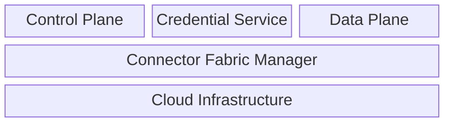

Many organizations participate in multiple dataspaces. An organization may do this using a single identity (that is, using an identifier such as a [DID](https://www.w3.org/TR/did/upcoming/)) or different identities. The system we are developing supports these multiplicities through ***service virtualization***: a single software deployment can enable an isolation environment to process requests for different participants and dataspace contexts.  We use the term virtualization over muti-tenancy for several reasons.  First, multi-tenancy is too ambiguous and has been used to denote different architectures. More importantly, multi-tenancy does not accurately describe the architecture this document lays out. As we will see, while connector services have the concept of an isolation context, it does not directly map to the concept of a "tenant." Instead, tenant management is externalized from the core connector and managed by an orchestration layer termed the ***Connector Fabric Manager (CFM).*** More on this later.    

## Service Virtualization Model

Service virtualization is based on the following model:

**Virtualization Model**

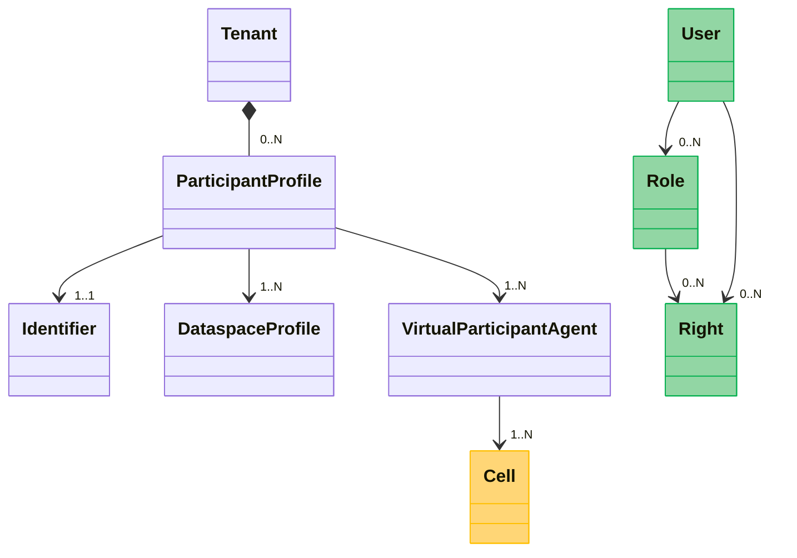

A **Tenant** represents an organization or entity that participates in one or more dataspaces. A **Participant Profile** exists for each dataspace the tenant participates in. The participant profile is associated with an **Identifier**, at least one **Dataspace Profile**, and at least one **Virtual Participant Agent (VPA)**. 

A Dataspace Profile includes a set of interoperable policies and DSP protocol version. 

A Virtual Participant Agent is a unit of administrative control and deployment. A VPA targets a **cell**. 

A **User** performs management operations against a VPA using an RBAC model based on **roles** and **rights**. 

The service virtualization layers in the control plane and data plane implement runtime isolation for each VPA. Importantly, they do not contain the concept of a tenant; the CFM orchestrator manages tenants.

The control and data planes use the VPA as the unit of runtime isolation. However, the services are loosely coupled through the [Data Plane Signaling Protocol]().  As will be detailed later, control plane and data plane deployments are typically remote and mapped by Participant Profile.

#### The Participant Profile

A dataspace has an overriding constraint:

> A participant has one and only one identifier

Note that this does not mean an organization (e.g., a legal entity) must have exactly one identifier. Rather, if an organization has multiple identifiers, it must either be mapped to a single identity (e.g., DID) or the organization must have multiple participants. 

Let's break down several different virtualization scenarios based on this using a fictitious organization, Acme Industries.

##### One identity per dataspace

In this scenario, Acme uses one DID per dataspace. This results in a participant profile per dataspace since the identifiers used for each dataspace are different.

##### One identity, multiple dataspaces

In this scenario, Acme uses a single DID across multiple dataspaces, resulting in a single participant profile for all dataspaces.

#### Virtual Participant Agents

 A VPA defines a runtime context that is deployed when a Participant Profile is provisioned. Let's consider a simple case where Acme participates in one dataspace. Returning to the logical systems architecture, VPAs for the control plane, credential service, and data plane(s) will be provisioned. This results in the creation of three VPA *types*:

- A Credential Service VPA
- A Control Plane VPA
- A Data Plane VPA

Multiple VPAs of the same type may also be deployed. For example, Acme may want to share streaming data and access to an API, which are served through different data planes. In this case, two VPAs will be created, one for each data plane. 

VPAs are linked through network, transport, and application security layers. As will be detailed further, a control plane and data plane VPA may rely on a VPN, TLS, and OAuth tokens for secure communications. 

##### Cell Targeting

VPAs are targeted to a *cell*, which is a homogenous deployment zone. A cell could be a Kubernetes cluster or some other infrastructure. Cells are responsible for their own scaling. For example, a Kubernetes-based cell may use an autoscaling system to add capacity dynamically.  

##### RBAC: Users, Roles, and Rights

> TODO: Incomplete

A **User** represents an administrator who can perform a set of actions against subsystems. Users have a set of **Rights** and/or are assigned **Roles**. 

## Service Architecture

The virtualization model we have outlined is realized across multiple services through runtime context isolation. A guiding principle is that this isolation is *configuration-based*, not process-based. A process-based architecture achieves isolation based on runtime segmentation. For example, a VPA following this approach would spin up a set of operating system processes such as control plane, data plane, and database instances. This is not scalable or efficient. Instead, a configuration-based isolation architecture involves writing VPA metadata to a persistent store. This metadata is used by shared services that create inexpensive isolation contexts on the fly when requests are received and processed. This provides efficient service utilization and makes context migration relatively easily - move the VPA metadata to a different cell and update request routing configuration.

**Configuration-Based Architecture**

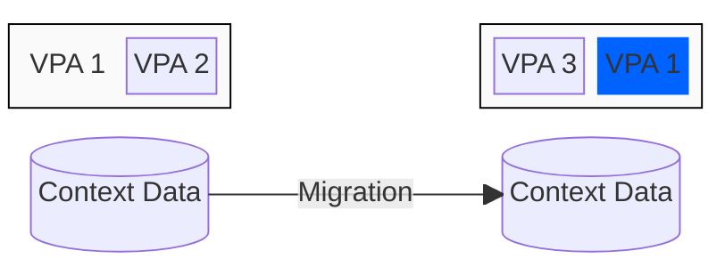

To implement this architecture, each service will provide APIs for creating, updating, and deleting VPA metadata. We now turn to how these services support this virtualization model.

### Connector Fabric Manager

[Project Source](https://github.com/Metaform/connector-fabric-manager)

The CFM performs two tasks: managing tenant metadata (Tenant Manager) and performing deployment orchestration (Provision Manager). 

**Connector Fabric Manager**

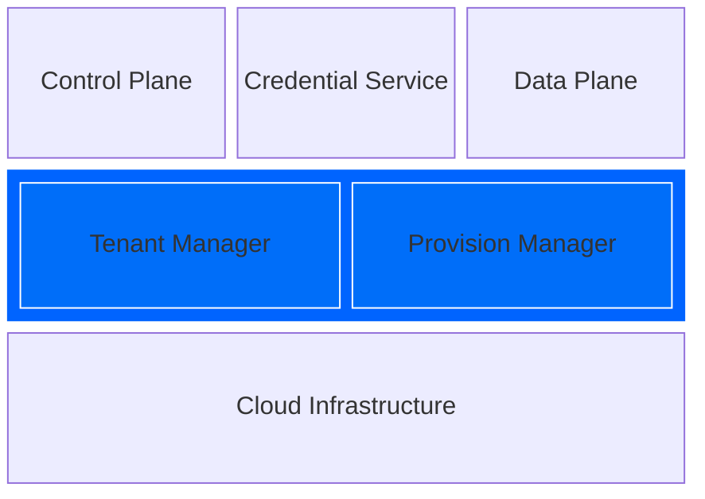

Let's start with a common scenario to understand how these subsystems work. Acme Industries will be onboarded into Dataspace-X by Nuvola Systems, a cloud service provider that has a Connector-as-a-Service offering. Nuvola Systems will perform the following steps:

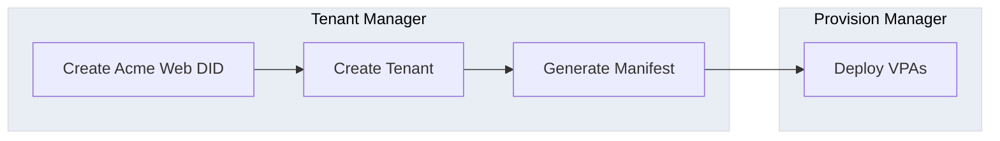

#### Tenant Manager

The Tenant Manager maintains a persistent store of tenant metadata, including the deployment state of VPAs associated with active participant profiles. When a change is made (e.g., create, update, or deletion), the Tenant Manager generates VPA deployments by creating a **Deployment Manifest** and submitting it to the Provision Manager's orchestration service.  

When Acme is onboarded, Nuvola registers a DNS name for Acme that will be used for its Web DID since Dataspace-X uses Web DIDs as identifiers. A tenant and participant profile is created, and the Tenant Manager generates three VPAs (Credential Service, Control Plane Service, and one Data Plane Service), along with a deployment manifest.    

The contents of the generated deployment manifest depend on Nuvola's specific infrastructure (we will cover the specifics when we discuss the Provision Manager). For example, deployment must set up DNS routing, load-balancing, and security for the deployed VPAs. To accommodate this specificity, the Tenant Manager supports **Generator** plugins that Nuvola uses to customize deployment manifest creation.

#### Provision Manager

The Provision Manager is responsible for orchestrating deployments and managing deployment state. It contains a **Deployment Orchestrator**, a workflow system built on a distributed, reliable messaging platform. When a deployment manifest is submitted, it is converted to an **Orchestration**. The orchestration contains a directed acyclic graph (DAG) of **Actions** that are asynchronously executed in order. To understand how this works, consider the deployment manifest generated for the Acme onboarding:

**Acme Onboarding Deployment**

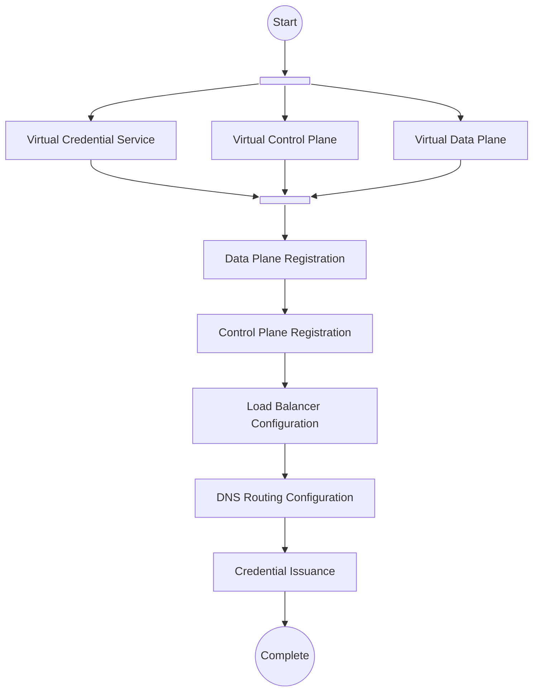

The deployment manifest results in an orchestration that starts by executing three parallel activities that create Acme's virtual services. When those activities complete, the virtual data plane and virtual control plane are registered with one another in sequence (for details, see below). These activities are followed by ones configuring load balancing for incoming requests, DNS routing, and completing the dataspace credential issuance process. 

The Deployment Orchestrator executes these activities asynchronously by sending messages to **activity executors** that perform tasks specified by the activity. For example, registering VPA metadata with a control plane cluster running in a cell. By default, the orchestration workflow system uses [NATS](https://nats.io)

##### Activity Executors

An activity executor is a process that listens for activity messages on a NATS queue and asynchronously performs a set of actions. When an activity completes, the Deployment Orchestrator advances the workflow. The workflow system supports reliable qualities of service and provides a distributed Key/Value store (built on NATS Jetstream) for state persistence.  The Deployment Orchestrator handles system reliability, context persistence, recovery, and activity coordination.

An activity executor is an extensibility point for integrating cloud provider customizations and technologies into the deployment process. For example, Nuvola has deployed a set of executors that perform load balancer and DNS routing configuration specific to its cloud environment. The CFM provides an activity executor framework written in Go. However, processors can be written in other languages using a NATS-compliant client library. 

##### Extension Model

Nuvola defines its deployment process using CFM's deployment extension model. A Deployment Manifest corresponds to a *type* defined by a **Deployment Definition**, which contains a set of **Activity Definitions**. The Deployment Definition specifies the sequence of activities to be executed, and an activity definition specifies the input and output data passed to and returned from an activity executor:

**Deployment Manifest, Deployment Definition, and Activity Definition**

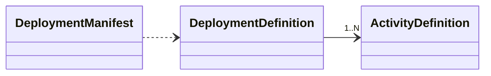

Deployment Definitions and Activity Definitions are added to the Provision Manager through a RESTful management API.

###### Standard Activity Definitions

The CFM will provide a collection of standard activities, including VPA deployments for the EDC control plane, Identity Hub, and the Industrial Data Plane.

### EDC Control Plane

[Project Source](https://github.com/eclipse-edc/Connector)

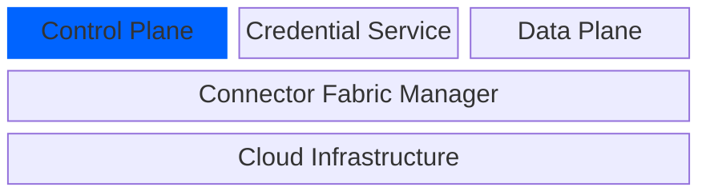

A specialized version of the EDC (EDC-V) will be used for the control plane with the following features:

- Support for virtualization contexts
- A message-based request processing implementation
- A dynamic policy engine
- A new management API to support VPA deployments
- A Kubernetes Operator for automated component setup

EDC-V is the same codebase as classic EDC, but with additional extensions designed to support context isolation and more efficient, specialized asynchronous processing.

#### Virtualization Contexts

The EDC-V control plane will support **Participant Contexts** and **Dataspace Contexts**, which are runtime analogs to Participant Profiles and Dataspace Profiles. They are created via a Management API during VPA deployment.

When a request is received by an EDC runtime, it will use the request URL to resolve the Participant Context and Dataspace Context. To see how this works, let's return to the Acme setup. Nuvola has registered the `connector.acmne-industries.com` subdomain with a DNS router that forwards the request to a load balancer cluster in the datacenter region where Acme's VPAs are targeted. The load balancers are configured to rewrite the URLs, forwarding them to the EDC control plane as `<host>/connector.acme-industries.com/dataspace-x`. The Participant Context and Dataspace Context can then be resolved from the URL path parts.

This setup can be used to support multi-region operations:

**Request Routing**

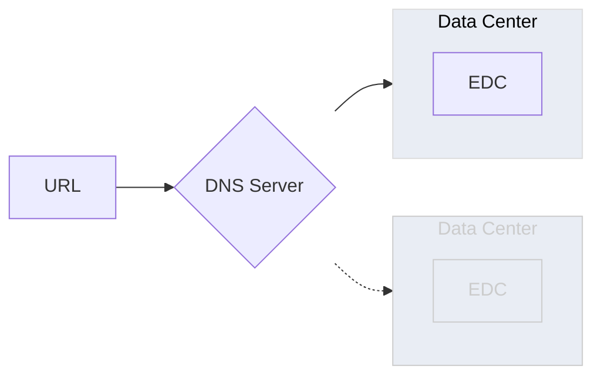

When the request is forwarded and received by the EDC runtime, the rewritten URL is used to resolve the Participant Context and Dataspace Context from a Postgres store. The virtual EDC is materialized, and the request is processed:

**Participant Context Processing**

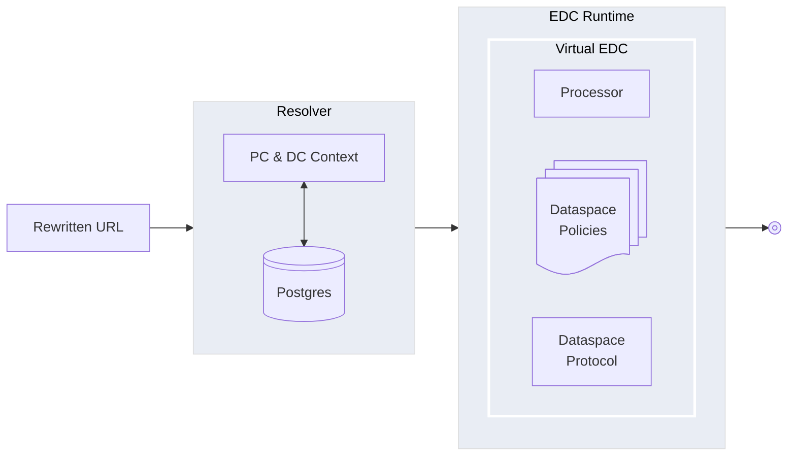

Note that this architecture supports dataspaces with multiple active DSP versions. For example, if Dataspace-X supports DSP v2025-01 and a future v202X-01, the dataspace context path in the request URL can be used to disambiguate the protocol version: `connector.acmne-industries.com/v2025-1` or `connector.acmne-industries.com/v202X-01`.

#### Message-Based Processing

Classic EDC is implemented using state machines that are advanced by asynchronous timers using exclusive database locks. When a request is received, it is persisted as a state machine entity. A background task periodically acquires exclusive locks on the state machine entities and performs processing. This strategy provides a simple mechanism to achieve guaranteed messaging in a clustered environment since it only requires a transactional database.:

**Classic EDC Task-Based Processing**

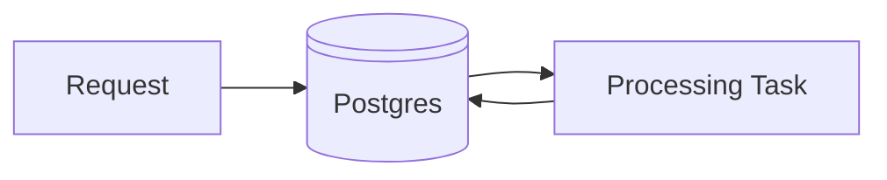

However, in hosted environments, this simplicity is not efficient as scheduled polling puts significant load on the database and results in excess compute resource consumption. In EDC-V, task-based processing will be replaced with message-based processing by replacing several EDC extensions with alternative implementations. Message-based processing will support the same reliable qualities of service and be based Postgres Change Data Capture (CDC) and NATS queuing (it will be possible to substitute another queue implementation for NATS):

**EDC-V Message-Based Processing**

When a message is received, it is persisted to a Postgres database configured with CDC, and an acknowledgement is returned to the client. This operation asynchronously triggers the CDC processor to transactionally publish a message to a NATS queue. The message is read, and the request is processed using optimistic concurrency. Further asynchronous processing can be performed by publishing additional messages.  

Message-based processing will provide more efficient operation since there is no need to poll the database or hold exclusive locks. In addition, it will be able to support multiple sharding strategies, such as a queue per message type (e.g., state) or a queue per set of participant IDs.

#### Dynamic Policy Engine

Policies may vary by dataspace or protocol version. We also need the ability to add new policies to a running deployment, for example, if Nuvola wants to roll out support for a new dataspace. The EDC Policy Engine uses Java code to perform policy evaluations. EDC-V will support delegating evaluation to an extension that can load policy expressions based on [Common Expression Language (CEL)](https://cel.dev) from a persistent store.  

#### EDC VPA Deployment Agent

A  CFM deployment agent will be developed that supports the automated creation of Participant Context and Dataspace Context information. 

#### Kubernetes Operator

A Kubernetes operator will be created that supports the deployment of an EDC control plane, data plane, and Identity Hub.

### EDC Identity Hub

[Project Source](https://github.com/eclipse-edc/IdentityHub)

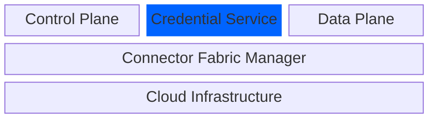

The Identity Hub already supports isolation through a Participant Context. Additional work will be performed to make this support production-grade.

### Data Planes

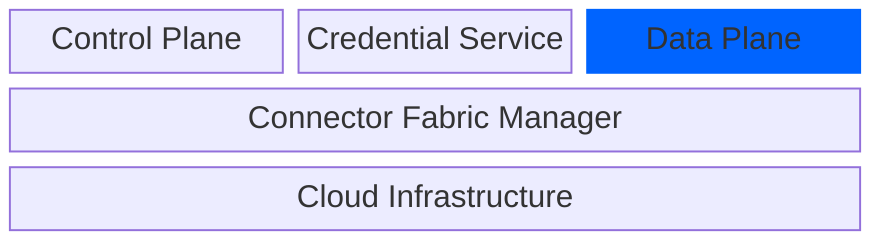

A Data Plane implements a wire protocol for sending data to another dataspace participant. For example, it may support a RESTful API or a streaming protocol such as Kafka. Multiple Data Planes may be registered with a single control plane, and it is generally recommended to implement a Data Plane per wire protocol. This allows data planes to be scaled independently based on specific operational characteristics. 

Data planes communicate with the EDC control plane through the [Data Plane Signaling API](https://github.com/Metaform/dataplane-signaling). The API's goal is to provide an interoperable communication mechanism to facilitate an ecosystem of third-party data planes. Like the EDC control plane, each data plane is responsible for supporting participant context isolation. 

#### Data Plane SDKs

[GO SDK](https://github.com/Metaform/dataplane-sdk-go)
[.NET SDK](https://github.com/Metaform/dataplane-sdk-net)

When a data transfer is initiated, the data plane transitions through a number of states that track the current wire protocol transmission:

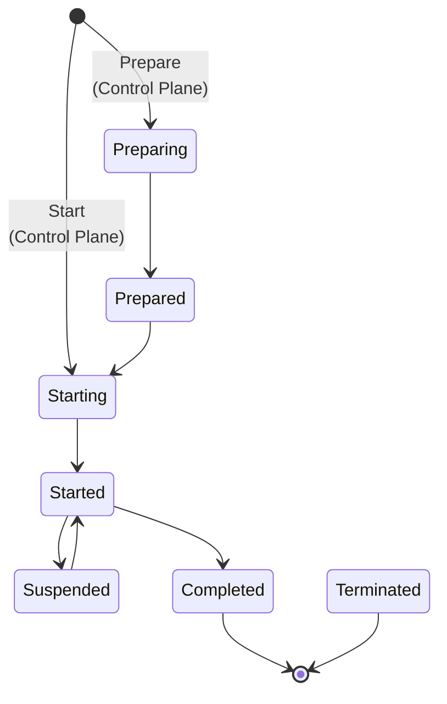

 Data Plane SDKs will be provided for Go, Java, .NET, Rust, and Typescript that facilitate development and design best practices. They provide an implementation of this state machine and messaging framework. Each SDK provides a language-specific callback mechanism to integrate with wire protocol code for the following events:
 
 - OnPrepare
 - OnStart
 - OnSuspend
 - OnTerminate
 - OnRecover

The following diagram depicts how a NATS-based data plane is created based on the [Go SDK example](https://github.com/Metaform/dataplane-sdk-go/tree/main/examples/streaming-pull-dataplane):

==TODO Sequence Diagram==
### VPA Registration Architecture

Communication between the EDC control plane, data plane, and Identity Hub happens at the VPA level, not at the process level. For example, when control plane and data plane VPAs are deployed, a channel is established between them, not the host systems (obviously, there must be network access between the host systems). In the case of the control plane and data plane, the channel must be bi-directional as the data plane asynchronously responds to control plane directives. 

VPA communication will be handled at the network level (e.g., restricting host access) and at the application level through an OAuth 2 Identity Provider (IdP). A VPA deployment agent will enable application-level security by enabling OAuth 2 Client Credentials Grant. This process is depicted below for bi-directional registration of the control plane and data plane:

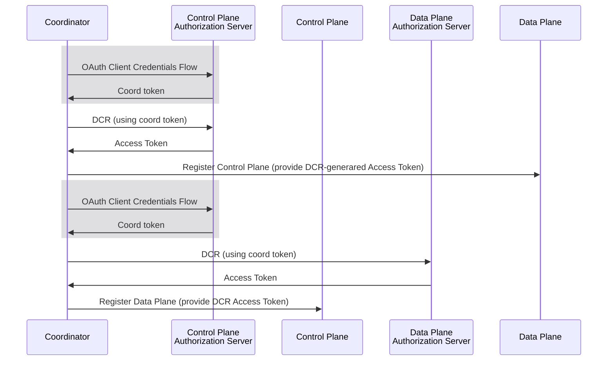

